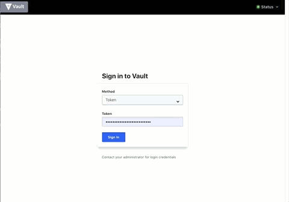
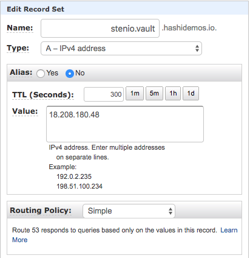

# Vault OpenID Demo

Vault 1.1.0 introduced OIDC Redirect Flow Support, allowing authentication using browser. This content describes the steps to integrate this feature, and authenticate with Vault using a Gmail address.



## Requirements

- Vault server with a "demo" ACL policy.
- A domain name for Vault.
- Google account.

## Configure Vault Domain

You can use any registrar, no specific requirements. 

### Steps to use AWS Route53

1. Log in to AWS, go to Route53
2. Create a Hosted Zone if none exist
3. Click on existing Hosted Zone
4. Click Create Record Set
5. Enter a name and update the IP value, as shown here:



6. Throughout these steps, assume that "YOUR_VAULT_ADDR" is a fully qualified URL like this example: 

    ```
    YOUR_VAULT_ADDR=http://stenio.vault.hashidemos.io:8200
    ```

    Substitute this example URL value with that of your actual Vault server URL plus port value.

## Configure Google

1. Go to https://console.developers.google.com/apis/credentials/, log in if needed
2. Click "Create credentials > OAuth ClientID"
3. Select "Web application", give it a name
4. On "Authorized redirect URIs", enter "http://YOUR_VAULT_ADDR//ui/vault/auth/oidc/oidc/callback"
5. Press Save
6. In the next step you will use the Client ID and the Client Secret when configuring Vault

## Configure Vault

1. Enable an instance of the OIDC auth method.

    ```shell
    vault auth enable oidc
    ```

1. Configure OIDC auth method with the Google client information.

    ```shell
    vault write auth/oidc/config \
        oidc_discovery_url="https://accounts.google.com" \
        oidc_client_id="YOUR_GOOGLE_API_CLIENT_ID" \
        oidc_client_secret="YOUR_GOOGLE_API_CLIENT_SECRET" \
        default_role="gmail"
    ```

2. Create a role to use for authentication. You can be as restrictive as desired by using the different "bound" fields. These allow you to specify values that need to be present from Google in order to allow authentication. [Here](https://developers.google.com/identity/protocols/OpenIDConnect#obtainuserinfo) documentation on claims and values sent by Google, [here](https://www.vaultproject.io/api/auth/jwt/index.html#create-role) information on the bound fields.

    ```shell
    vault write auth/oidc/role/gmail \
        user_claim="sub" \
        bound_audiences=[YOUR_GOOGLE_API_CLIENT_ID] \
        allowed_redirect_uris="http://YOUR_VAULT_ADDR//ui/vault/auth/oidc/oidc/callback" \
        policies=demo \
        ttl=1h
    ```

## Login

1. Go to Vault UI.
2. Select "OIDC auth".
3. Enter the role you want to log in to Vault with. This example has just one role, but you can create more, and associate them with different claims and bounds as needed.
4. Log in.
